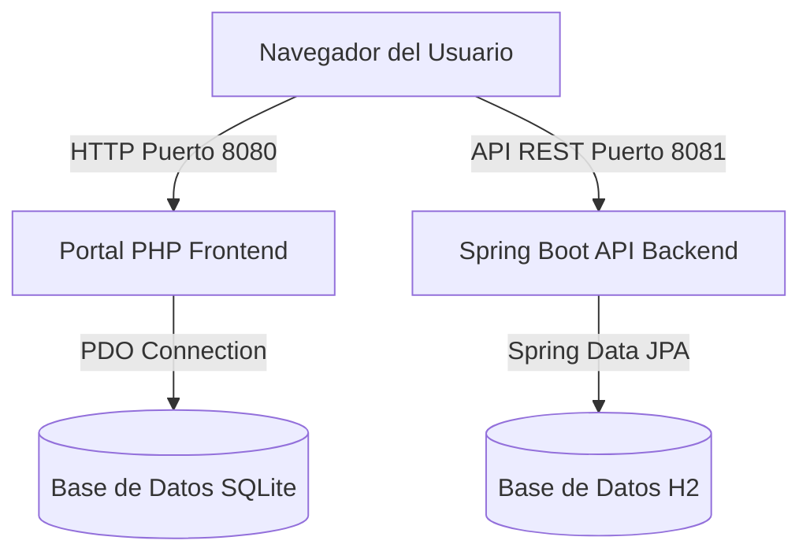

# 🏛️ Arquitectura del ERP Escolar

Este documento describe la arquitectura, la estructura de directorios y los principios de diseño del sistema ERP Escolar.

---

## 1. Vista General del Sistema

El ERP Escolar está diseñado con un modelo **híbrido y modular** que integra dos ecosistemas principales:

1. **Frontend y Lógica de Negocio PHP (Core Principal)**:
   - Servido en el puerto `8080` (entorno local).
   - Maneja la landing page de invitados, portales de estudiantes, acudientes, docentes, coordinadores, directores y administradores.
   - Realiza consultas y operaciones directas en una base de datos relacional ligera **SQLite**.
   
2. **Backend API Spring Boot (Servicios de Transición/Futuros)**:
   - Basado en **Java 21** y **Spring Boot 3.2.5** ejecutándose en el puerto `8081`.
   - Utiliza una base de datos **H2** en archivo persistente (`./data/escuela_erp`).
   - Expone endpoints REST para integración con servicios móviles u otros módulos desacoplados.



---

## 2. Estructura de Directorios

El repositorio se organiza de la siguiente manera:

```text
├── .github/workflows/      # Pipelines de CI/CD (GitHub Actions)
├── auth/                   # Módulo de Autenticación, Registro y 2FA
├── config/                 # Configuraciones de base de datos y autenticación
│   ├── auth.php            # Middleware de sesión, roles, permisos y sanitización
│   └── database.php        # Conexión Singleton PDO a SQLite con Dotenv
├── database/               # Esquemas SQL (.sql) y bases de datos SQLite (.sqlite)
├── modules/                # Módulos del negocio escolar (calificaciones, asistencias, etc.)
├── src/main/java/          # Código fuente del backend Java Spring Boot
├── src_php/                # Clases PHP adicionales (autoloading PSR-4)
├── target/                 # Binarios compilados de Java (Maven)
├── tests/                  # Pruebas unitarias de PHP
├── views/layout/           # Plantillas compartidas (header, sidebar, footer)
├── index.php               # Dashboard principal / Landing Page
└── pom.xml                 # Descriptor de dependencias de Maven (Java)
```

---

## 3. Configuración y Entornos

El sistema soporta la carga dinámica de configuraciones a través del archivo `.env` en la raíz del proyecto.
El archivo `config/database.php` inicia el cargador `vlucas/phpdotenv` si la carpeta `vendor/` está presente y utiliza la variable `DB_PATH` para resolver la ubicación de la base de datos de manera dinámica, facilitando despliegues en entornos de pruebas, preproducción y producción.

---

## 4. Medidas de Seguridad Implementadas

1. **Protección CSRF**:
   - Se generan tokens únicos de sesión (`Auth::csrfToken()`) que son obligatorios en todas las peticiones `POST` para prevenir ataques de falsificación de peticiones en sitios cruzados.
   
2. **Protección Contra Fuerza Bruta**:
   - Bloqueo dinámico por dirección IP en `Auth::checkBruteForce()`.
   - Si una dirección IP supera los 5 intentos de inicio de sesión fallidos, se le bloquea el acceso durante 15 minutos.

3. **Sanitización de Inputs**:
   - Limpieza sistemática de datos enviados por formularios usando `htmlspecialchars` y `trim` en `Auth::sanitize()`.

4. **Integridad de Datos**:
   - Habilitación forzada de restricciones de clave foránea en SQLite mediante `PRAGMA foreign_keys = ON;`.
