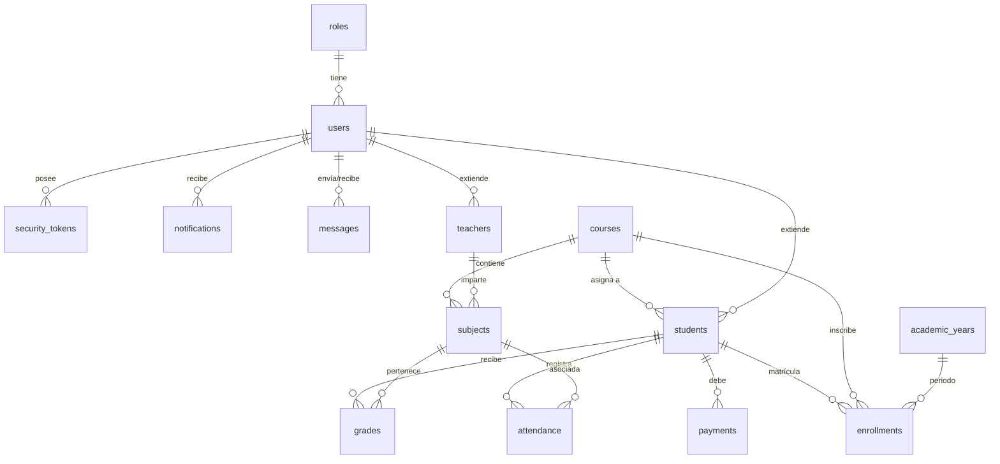

# 🗄️ Diccionario y Modelo de Datos del ERP Escolar

Este documento complementa el esquema de la base de datos detallando las relaciones lógicas y diagramas de entidad-relación (ERD) en el sistema.

---

## 1. Diagrama de Entidad-Relación (ERD)



---

## 2. Descripción Detallada del Esquema

Para una documentación exhaustiva campo por campo, consulta el diccionario de datos completo:

👉 **[Diccionario de Datos y Tablas (SCHEMA.md)](file:///home/andres/Escuelas/escuelas/database/SCHEMA.md)**

---

## 3. Optimizaciones e Índices Recomendados

Para bases de datos SQLite en producción, se recomienda crear los siguientes índices compuestos para optimizar consultas frecuentes:

```sql
-- Optimización de búsqueda de sesiones y roles
CREATE INDEX IF NOT EXISTS idx_users_email ON users(email);
CREATE INDEX IF NOT EXISTS idx_users_document ON users(document);

-- Optimización del registro de calificaciones
CREATE INDEX IF NOT EXISTS idx_grades_student_subject ON grades(student_id, subject_id);

-- Optimización de reportes de asistencia
CREATE INDEX IF NOT EXISTS idx_attendance_student_date ON attendance(student_id, date);
```
